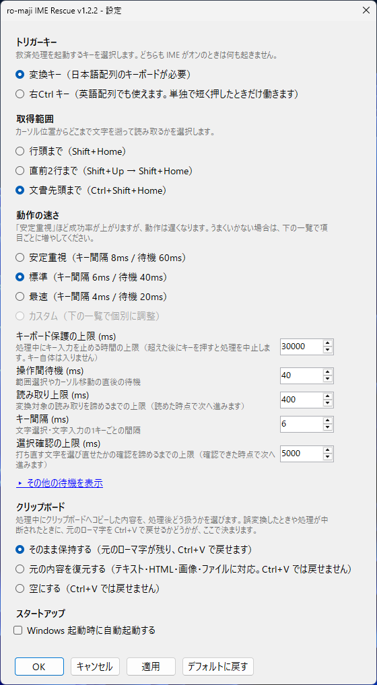

<div class="hero">
  <div class="hero-head">
    
    <div class="hero-titles">
      <h1>ro-maji IME Rescue</h1>
      <p class="hero-tagline">ローマ字を日本語に変換するアプリ</p>
    </div>
  </div>

  <p class="hero-lead">IME をオフにしたまま打ってしまったローマ字を<strong>キーひとつ</strong>で日本語に入力し直します、消して打ち直す必要はありません。</p>
  <p class="hero-lead-note">（変換キー。設定で右Ctrl キーにも変更できます。Microsoft IME / Google 日本語入力で動作確認済み）</p>

  <div class="cta">
    <a class="btn-primary" href="{{ site.store_url }}">Microsoft Store で入手</a>
    <p class="cta-note">15日間の無料体験版があります。ご購入の前に<a href="#env">動作環境</a>と<a href="#limits">できないこと</a>をご確認ください。</p>
  </div>

  <div class="hero-showcase">
    <div class="demo">
      <div class="demo-row is-before">
        <span class="demo-label">IME オフのまま打ってしまった</span>
        <p class="demo-text">kyouhaHTMLtoAPIwobenkyousita</p>
      </div>
      <div class="demo-key">
        <kbd>変換</kbd>
        <span>カーソルを文字列の直後に置いて押すだけ。範囲を選択する必要はありません。</span>
      </div>
      <div class="demo-row is-after">
        <span class="demo-label">日本語に入力し直される</span>
        <p class="demo-text">今日はHTMLとAPIを勉強した</p>
      </div>
    </div>
    <ul class="cards">
      <li><b>キーひとつで完結</b><span>変換キーを押すだけ。覚えるショートカットはありません。英語配列のキーボードでは右Ctrl キーに変更できます。</span></li>
      <li><b>邪魔をしません</b><span>IME がオンのときはそのキー本来の動作をするので、普段の日本語入力の邪魔をしません。</span></li>
    </ul>
  </div>

  <p class="hero-foot">起動するとタスクトレイに常駐します。文字の読み取りにコピー操作を使うため、処理中はクリップボードを一時的に上書きします。</p>
</div>

## 実際の画面 {#screens}

<div class="shots">
  <figure class="shot">
    
    <figcaption>変換キーを押す前</figcaption>
  </figure>
  <figure class="shot">
    
    <figcaption>変換キーを押した後</figcaption>
  </figure>
</div>

<div class="can-row" markdown="1">
<section class="can-col" markdown="1">

## できること {#can}

<div class="limits" markdown="1">
<div class="limit-item" markdown="1">

### 区切りまで、まとめて変換します

カーソル直前の半角英数を、区切りまでまとめて変換します。範囲を選択する必要はありません。区切りになるのは**半角スペースと改行**だけで、変換済みの日本語の直後でも止まります。

```
kyounotenkihaharedeatatakaidesu
→ 今日の天気は晴れで温かいです
```

画面端での折り返しは影響しません。折り返して数行に見えていても、Enter を押していなければ 1 行として扱います。ただし<a href="#long-text">一度に変換する文字数が多いと、IME 側で先頭から確定されていきます</a>。

</div>
<div class="limit-item" markdown="1">

### 大文字の英単語は、そのままの表記で残ります

`API` `HTML` のような略語は、変換されずに元の表記のまま残ります。**「A社」「B案」のような 1 文字だけの大文字も残ります。**

```
kyouhaHTMLwobenkyou  → 今日はHTMLを勉強
Bandeikimasu         → B案で行きます
```

</div>
</div>

</section>
<aside class="can-col changelog" markdown="1">

## 変更履歴 {#changelog}

<div class="changelog-body">
<div class="changelog-scroll" markdown="1">

### v1.2.0

- **右Ctrl キーでも使えるようになりました**

  設定画面から選べます。英語配列（US / ANSI）のキーボードでもお使いいただけます。単独で短く押したときだけ働くため、Ctrl+C や Ctrl+クリックなどの組み合わせ操作はこれまでどおりです。

- **処理中にクリックすると、いつでも中止できるようになりました**

  これまでは処理の途中でクリックして別のウィンドウへ移ると、変換中の文字がそちらへ入力されてしまうことがありました。マウスのボタンが押されたら、その時点で安全に打ち切ります。

- **クリップボードの復元が画像やファイルにも対応しました**

  「元の内容を復元」を選んでいる場合、これまではテキストしか戻せませんでした。画像・ファイル・Web ページからコピーした書式付きテキストも戻ります。

- **上限を調整する項目が増えました**

  キー入力を止める時間の上限（既定 30 秒）と、選択の確認にかける時間の上限（既定 5 秒）を調整できます。あわせて「コピー完了待機」を「読み取り上限」に変更したため、この項目を調整されていた場合は既定値に戻ります。

- **失敗したときの案内を原因ごとに分けました**

  「選択状態を確認できませんでした」が原因によらず同じ文面でしたが、原因ごとの対処法を表示します。

### v1.1.0

- **1 文字だけの大文字も、そのまま残るようになりました**

  v1.0.3 では複数文字の大文字表記だけを保持していたため、「A社」「B案」のような表記が崩れていました。

- **取りこぼしを自動で再試行するようになりました**

  入力が速い環境などで選択の取りこぼしが起きた場合、安全な範囲で自動的に 1 回だけ再試行します。多くの場合、設定を変えなくても解決します。

- **設定画面に「安定重視 / 標準 / 最速」を追加しました**

  待機時間を個別に調整する代わりに、まずこの 3 つから選べます。

### v1.0.3

- **大文字表記の英単語が、そのまま残るようになりました**

  「API」「OK」「HTML」のように大文字が 2 文字以上続く部分は、変換せずに元の表記のまま残します。

### v1.0.2

- **高 DPI 表示（150% / 200%）での表示崩れを修正しました**

  設定画面で文字が重なる、ボタンが画面外に出て押せない、といった不具合を直しました。

- **変換処理を高速化しました**

  100 文字の変換で約 1.7 倍速くなりました。

</div>
</div>

</aside>
</div>

## 設定 {#settings}

タスクトレイのアイコンをダブルクリックすると設定画面が開きます。

<div class="settings">
  <figure class="shot">
    
  </figure>
  <ul class="settings-list">
    <li><b>取得範囲</b><span>カーソル位置からどこまで文字を遡って読み取るかを選べます。行頭まで／直前2行まで／文書先頭まで。</span></li>
    <li><b>動作の速さ</b><span>「安定重視／標準／最速」から選べます。動作が追いつかないアプリでは「安定重視」にしてください。詳細設定を開けば、待機時間や各種の上限を個別に調整することもできます。</span></li>
    <li><b>クリップボード</b><span>処理中に一時的に上書きされる内容の扱いを選べます。そのまま保持／元の内容を復元／空にする。</span></li>
    <li><b>スタートアップ</b><span>Windows 起動時の自動起動に対応しています。既定はオフです。</span></li>
  </ul>
</div>

## できないこと・制限事項 {#limits}

<div class="limits" markdown="1">
<div class="limit-item" markdown="1">

### Enter で改行した位置を越えて変換できません

変換されるのは、直前の改行からカーソルまでの範囲だけです。それより前の行は残ります。

```
kyouhaiitenki           ← Enter で改行したので変換されません
desunodesannposisimasu  ← ここにカーソルがあると、この範囲だけ変換されます
```

改行で区切られた範囲ごとに、末尾へカーソルを置いて変換してください。

</div>
<div class="limit-item" markdown="1">

### 処理中にクリックすると中止されます

変換中はキーボードを一時的にロックしていますが、**マウスはロックしません。** ボタンを押すと、その時点で処理を安全に中止します。止めたいときはクリックしてください。逆に、止めるつもりがないなら処理中はクリックしないでください。

中断した位置によって結果が変わります。文字を消す前であれば無傷なので、やり直すだけです。消した後・打ち直しの途中だった場合は、元のローマ字を戻せるかどうかがクリップボードの設定で決まります。

| クリップボードの扱い | 元のローマ字を戻せるか |
|---|---|
| そのまま保持する（既定） | **`Ctrl+V` で戻せます** |
| 元の内容を復元する | 戻せません |
| 空にする | 戻せません |

既定のままお使いいただければ、中断されても貼り戻せます。

</div>
<div class="limit-item" markdown="1">

### 長い文章を一度に変換すると先頭が確定されます

一度に変換する文字数が多いと、**IME が先頭のほうから順に変換を自動で確定していきます。** 確定された部分は変換候補を選び直せなくなるため、誤変換の修正に手間がかかります。

目安は**ローマ字で 150 文字程度**です。ただし文の区切り方によって前後します。処理時間も文字数に比例して伸びるため、うっかりクリックして中断する余地も広がります。文や文節の区切りごとに変換すると、変換候補を選び直せる状態を保てます。

</div>
<div class="limit-item" markdown="1">

### 小文字の英単語は残せません

`api` のように**小文字の英単語はローマ字と区別する方法がない**ため、かなとして読み直されます。`export` のようにローマ字として成立しない綴りは、かなと英字が混じった結果になります。

```
apiwotukau          → アピを使う
PDFwoexportshimasu  → PDFを得x歩rtします
```

残したい英単語は**大文字で入力する**か、間に半角スペースを入れてから変換してください。

</div>
<div class="limit-item" markdown="1">

### その他

- すべてのアプリで動作するわけではありません。対象アプリのコピー操作、選択操作、IME 制御の挙動に依存します。
- パスワード欄など、内容を知られたくない入力欄では使用しないでください。
- 対象のアプリが管理者権限で動作している場合、Windows の仕組み（UIPI）により操作できません。

症状ごとの切り分け手順は[トラブルシューティング](troubleshooting.html)にまとめています。

</div>
</div>

## 動作環境 {#env}

<div class="env" markdown="1">

| 項目 | 要件 |
|---|---|
| OS | Windows 10 バージョン 2004（ビルド 19041）以降 / Windows 11 |
| アーキテクチャ | 64ビット（x64） |
| キーボード | **変換キー**（日本語配列 / JIS）または**右Ctrl キー** |

<p class="env-note">.NET のインストールは不要です。ネットワーク通信を行わず、管理者権限も必要ありません。</p>

<div class="env-warn">
  <p class="note-title">起動用のキーはこの2つから選びます</p>
  <p>変換キーは日本語配列（106/109 キー）にあるキーで、英語配列（US / ANSI）には存在しません。<strong>英語配列のキーボードでは右Ctrl キーをお使いください。</strong>右Ctrl キーは単独で短く押したときだけ働くため、Ctrl+C や Ctrl+クリックはこれまでどおりです。</p>
  <p>これ以外のキーへ割り当てを変更する機能はありません。ただし AutoHotkey などで任意のキーから変換キーを送っている場合は動作します（どのキーから送られたかは区別しないため）。</p>
</div>

</div>

## よくある質問 {#faq}

<div class="faq">
  <details>
    <summary>英語配列のキーボードでも使えますか</summary>
    <p>使えます。設定画面で起動用のキーを「右Ctrl キー」に変更してください。変換キーは日本語配列（106/109 キー）にあるキーで英語配列（US / ANSI）には存在しませんが、右Ctrl キーはどちらの配列にもあります。右Ctrl キーを単独で短く押したときだけ働くため、Ctrl+C や Ctrl+クリックなどの組み合わせ操作はこれまでどおり使えます。</p>
  </details>
  <details>
    <summary>無料で試せますか</summary>
    <p>15日間の無料体験版があります。Microsoft Store から入手できます。</p>
  </details>
  <details>
    <summary>インターネット接続や .NET は必要ですか</summary>
    <p>どちらも不要です。本アプリはネットワーク通信を一切行わず、必要なものはすべてアプリに含まれています。管理者権限も必要ありません。</p>
  </details>
  <details>
    <summary>Google 日本語入力でも動きますか</summary>
    <p>動きます。Microsoft IME と Google 日本語入力の両方で動作を確認しています。</p>
  </details>
  <details>
    <summary>API や HTML のような英単語も変換されてしまいますか</summary>
    <p>大文字はそのままの表記で残ります（1 文字でも保持されます）。<code>api</code> のような小文字の英単語はローマ字と区別する方法がないため、かなとして読み直されます。<code>export</code> のようにローマ字として成立しない綴りは、かなと英字が混じった結果になります。残したい英単語は大文字で入力するか、間に半角スペースを入れてから変換してください。</p>
  </details>
  <details>
    <summary>Enter で改行した前の行も変換できますか</summary>
    <p>できません。変換されるのは、直前の改行からカーソルまでの範囲だけです。画面端での折り返しは影響しないため、Enter を押していなければ複数行に見えていてもまとめて変換されます。</p>
  </details>
</div>

<script type="application/ld+json">
{
  "@context": "https://schema.org",
  "@type": "FAQPage",
  "@id": "{{ '/' | absolute_url }}#faq",
  "mainEntity": [
    {
      "@type": "Question",
      "name": "英語配列のキーボードでも使えますか",
      "acceptedAnswer": {
        "@type": "Answer",
        "text": "使えます。設定画面で起動用のキーを「右Ctrl キー」に変更してください。変換キーは日本語配列（106/109 キー）にあるキーで英語配列（US / ANSI）には存在しませんが、右Ctrl キーはどちらの配列にもあります。右Ctrl キーを単独で短く押したときだけ働くため、Ctrl+C や Ctrl+クリックなどの組み合わせ操作はこれまでどおり使えます。"
      }
    },
    {
      "@type": "Question",
      "name": "無料で試せますか",
      "acceptedAnswer": {
        "@type": "Answer",
        "text": "15日間の無料体験版があります。Microsoft Store から入手できます。"
      }
    },
    {
      "@type": "Question",
      "name": "インターネット接続や .NET は必要ですか",
      "acceptedAnswer": {
        "@type": "Answer",
        "text": "どちらも不要です。本アプリはネットワーク通信を一切行わず、必要なものはすべてアプリに含まれています。管理者権限も必要ありません。"
      }
    },
    {
      "@type": "Question",
      "name": "Google 日本語入力でも動きますか",
      "acceptedAnswer": {
        "@type": "Answer",
        "text": "動きます。Microsoft IME と Google 日本語入力の両方で動作を確認しています。"
      }
    },
    {
      "@type": "Question",
      "name": "API や HTML のような英単語も変換されてしまいますか",
      "acceptedAnswer": {
        "@type": "Answer",
        "text": "大文字はそのままの表記で残ります（1 文字でも保持されます）。api のような小文字の英単語はローマ字と区別する方法がないため、かなとして読み直されます。export のようにローマ字として成立しない綴りは、かなと英字が混じった結果になります。残したい英単語は大文字で入力するか、間に半角スペースを入れてから変換してください。"
      }
    },
    {
      "@type": "Question",
      "name": "Enter で改行した前の行も変換できますか",
      "acceptedAnswer": {
        "@type": "Answer",
        "text": "できません。変換されるのは、直前の改行からカーソルまでの範囲だけです。画面端での折り返しは影響しないため、Enter を押していなければ複数行に見えていてもまとめて変換されます。"
      }
    }
  ]
}
</script>
