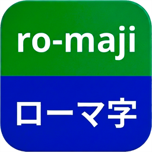
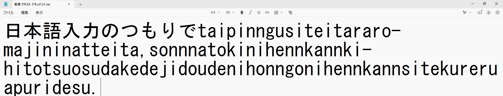
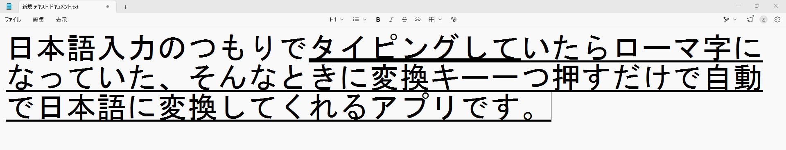

<div class="hero">
  
  <h1>ro-maji IME Rescue</h1>
  <p class="hero-tagline">ローマ字を日本語に変換するアプリ</p>
  <p class="hero-lead">IME をオフにしたまま打ってしまったローマ字を、<strong>変換キーひとつ</strong>で日本語に入力し直します。消して打ち直す必要はありません。</p>

  <div class="demo">
    <div class="demo-row">
      <span class="demo-label">IME オフのまま打ってしまった</span>
      <p class="demo-text">誤って打ったro-majimojiretuwohennkannki-ippatudenihonngonihennkannsimasu.</p>
    </div>
    <div class="demo-key">
      <kbd>変換</kbd>
      <span>カーソルを文字列の直後に置いて、押すだけ</span>
    </div>
    <div class="demo-row is-after">
      <span class="demo-label">日本語に入力し直される</span>
      <p class="demo-text">誤って打ったローマ字文字列を変換キー一発で日本語に変換します。</p>
    </div>
  </div>
</div>

## 実際の画面

打ち間違えた状態で変換キーを押すと、その場で日本語に入力し直されます。

<div class="shot"></div>

<p class="shot-caption">変換キーを押す前。IME をオフにしたまま打ってしまった状態。</p>

<div class="shot"></div>

<p class="shot-caption">変換キーを押した後。範囲を選択する操作は必要ありません。</p>

## 使い方

1. アプリを起動します。タスクトレイに常駐します。
2. IME をオフにしたままローマ字を打ってしまったら、カーソルをその直後に置きます。
3. **変換キー**を押します。

これだけです。範囲を選択する必要はありません。IME がオンのときは、変換キーは通常どおり動作します。

## 特長

<ul class="cards">
  <li><b>変換キーひとつで完結</b><span>覚えるショートカットはありません。打ち間違えたら、そのまま押すだけ。</span></li>
  <li><b>邪魔をしません</b><span>IME がオンのときは通常の変換キーとして動作します。タスクトレイに常駐し、ウィンドウは表示されません。</span></li>
  <li><b>文章を壊しません</b><span>処理に失敗した場合は文字を消さずに中断します。元の文章はそのまま残ります。</span></li>
  <li><b>通信しません</b><span>ネットワーク通信を一切行いません。入力内容が外部に送信されることはありません。管理者権限も不要です。</span></li>
</ul>

## 動作環境

| 項目 | 要件 |
|---|---|
| OS | Windows 10 バージョン 2004（ビルド 19041）以降 / Windows 11 |
| アーキテクチャ | 64ビット（x64） |
| キーボード | **変換キーがあること**（日本語配列 / JIS） |
| IME | 日本語 IME（Microsoft IME など） |

.NET のインストールは不要です。必要なものはすべてアプリに含まれています。管理者権限も必要ありません。

<div class="note">
  <p class="note-title">変換キーのないキーボードでは動作しません</p>
  <p>本アプリは<strong>変換キーだけ</strong>を合図に動作します。変換キーは日本語配列（106/109 キー）のキーボードにあるキーで、<strong>英語配列（US / ANSI）のキーボードには存在しません。</strong></p>
  <p>英語配列のキーボードをお使いの場合、そのままでは動作しません。本アプリ側に、他のキーへ割り当てを変更する機能はありません。なお、キー割り当てを変更するツール（AutoHotkey など）で任意のキーから変換キーを送るようにしている場合は動作します。本アプリは、変換キーがどのキーから送られたかを区別しないためです。</p>
  <p>日本語配列のキーボードでも、Windows のキーボードレイアウト設定が英語配列になっていると変換キーが認識されないことがあります。</p>
</div>

## 入手

Microsoft Store で配布しています（有料）。**7日間の無料体験版**があります。

ご購入の前に、上記の**動作環境**と下記の**制限事項**を必ずご確認ください。特に、変換キーのない英語配列（US / ANSI）のキーボードでは動作しません。

[Microsoft Store で入手](https://apps.microsoft.com/detail/9ND04SG0293F)

## 制限事項

### 直前の半角英数はまとめて対象になります

カーソル直前の半角英数は、空白で区切られていない限りすべて変換対象になります。

```
HTMLnokakikata   → HTML ごと変換されてしまいます
HTML nokakikata  → nokakikata だけが変換されます
```

どこからが打ち間違えたローマ字なのかを判別する方法がないためです。意図して入力した英数字を残したい場合は、間に半角スペースを入れてから変換してください。

### 大文字も英単語も小文字のかな入力になります

巻き込まれた英字は、すべて小文字化されたうえでローマ字として入力し直されます。

- `HTML` のような大文字は小文字になります
- `test` のような英単語も、英語としてではなくローマ字として読まれます

**英字を元の表記のまま残すことはできません。**

詳しくは[トラブルシューティング](troubleshooting.html)を参照してください。

### その他

- すべてのアプリで動作するわけではありません。対象アプリのコピー操作、選択操作、IME 制御の挙動に依存します。
- パスワード欄など、内容を知られたくない入力欄では使用しないでください。
- 対象のアプリが管理者権限で動作している場合、Windows の仕組み（UIPI）により操作できません。

## うまく動かないとき

設定画面から各動作の待機時間を調整できます。まず **操作間待機** を増やしてみてください。

症状ごとの詳しい切り分け手順は下記にまとめています。

- [トラブルシューティング](troubleshooting.html)

## サポート

不具合の報告やご質問は以下までご連絡ください。

- [moappsupport@gmail.com](mailto:moappsupport@gmail.com)

## プライバシー

本アプリは個人情報を収集・保存・送信しません。詳細は[プライバシーポリシー](privacy.html)をご覧ください。
